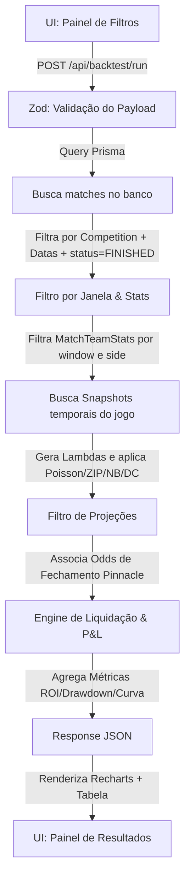

# Backtest_Direcoes

# PRD — Ferramenta de Backtest (Big Data Bet)

## 1. Contexto rápido

Ferramenta interativa (**Fase 5**) que permite ao usuário filtrar jogos por critérios estatísticos, rodar uma estratégia contra a base histórica e visualizar resultados (gráficos + tabela + resumo).

Origem dos dados: **sempre a base de dados do projeto** (tabelas `matches`, `MatchStats` e `MatchOdds` já populadas). Nenhum dado é calculado a partir de fonte externa em runtime para garantir alta performance e integridade dos testes históricos.

## 2. Escopo desta entrega

- **Modelagem de dados (Prisma):** Adição de tabelas para médias históricas por janela (`MatchTeamStats`), parâmetros temporais da liga (`LeagueSnapshot`) e persistência de backtests (`SavedBacktest`) integradas aos modelos existentes (`Match`, `Team`, `Season`, `Competition`).
- **Contratos de API (Zod):** Validação estrita dos filtros dinâmicos de médias históricas, filtros de projeções matemáticas dos modelos, intervalo temporal e especificação da estratégia de aposta.
- **Cálculo de Resultados:** Motor de liquidação no servidor para mercados 1X2, BTTS (Ambos Marcam), Over/Under (incluindo linhas de quartos, meias e inteiras) e Asian Handicap (Handicap Asiático).
- **Projeções de Modelos:** Integração dos 4 modelos analíticos da plataforma (Poisson, Dixon-Coles, ZIP e Binomial Negativa) e suas estimativas de lambda ($λ_H, λ_A$) como critérios de filtragem de valor no backtest, calculados usando os snapshots temporais de time e liga antes de cada partida.
- **Regras anti-leakage:** Garantia de que médias de rodadas passadas não incluam o próprio jogo ou jogos futuros (validado por suíte de testes dedicada).
- **Visualização (UI):** Exibição da curva de saldo acumulado (Recharts), tabela de jogos validados com P&L, e cards de resumo com taxa de acerto (hit rate), ROI e Max Drawdown.

Fora de escopo agora: Automações de ingestão de dados em tempo real ou triggers automáticos via Bull/Redis (Fase 6).

## 3. Modelagem de dados

A ferramenta utilizará as tabelas existentes `matches` (com gols em `fthg` e `ftag`, data em `utcDate` e status em `status`), `teams`, `seasons` e `Competition` (ligas). Para otimizar a performance das consultas, serão introduzidos três novos modelos no `schema.prisma`.

```prisma
// Apenas as adições ao schema.prisma existente:

// Parâmetros estatísticos globais da liga calculados no ponto temporal antes de cada jogo
model LeagueSnapshot {
  id            String   @id @default(cuid())
  competitionId String
  seasonId      String
  matchId       String   @unique
  utcDate       DateTime

  // Médias e parâmetros de dispersão/modelagem acumulados até a data desta partida
  muH           Float    // Média gols mandante na liga
  muA           Float    // Média gols visitante na liga
  varH          Float    // Variância gols mandante na liga (NB)
  varA          Float    // Variância gols visitante na liga (NB)
  piH           Float    // Excesso de zeros mandante na liga (ZIP)
  piA           Float    // Excesso de zeros visitante na liga (ZIP)
  rho           Float    // Parâmetro de correlação Dixon-Coles (global da temporada)
  totalJogos    Int      // Amostra de jogos acumulada na temporada

  competition   Competition @relation(fields: [competitionId], references: [id], onDelete: Cascade)
  season        Season      @relation(fields: [seasonId], references: [id], onDelete: Cascade)
  match         Match       @relation(fields: [matchId], references: [id], onDelete: Cascade)

  @@unique([matchId])
  @@index([competitionId, seasonId, utcDate])
  @@map("league_snapshots")
}

// Médias primárias acumuladas do time antes da realização do jogo correspondente
model MatchTeamStats {
  id                String   @id @default(cuid())
  matchId           String
  teamId            String
  side              Side     // HOME | AWAY (lado em que o time joga nesta partida)
  window            Int?     // 5 | 10 | 20 | 40 | null = Total/Temporada inteira

  // Médias computadas estritamente com base nos jogos passados (utcDate < match.utcDate)
  avgGoalsScored    Float?
  avgGoalsConceded  Float?
  cvGoals           Float?   // Coeficiente de Variação dos gols marcados (DP / média)
  avgCorners        Float?
  avgShots          Float?
  avgShotsOnTarget  Float?
  xg                Float?   // Expected Goals médio (derivado de MatchStats)
  passAccuracy      Float?   // Percentual médio de passes certos (accurate / total)

  // Relações com tabelas existentes
  match             Match    @relation(fields: [matchId], references: [id], onDelete: Cascade)
  team              Team     @relation(fields: [teamId], references: [id], onDelete: Cascade)

  @@unique([matchId, teamId, window])
  @@index([side, window])
  @@map("match_team_stats")
}

enum Side {
  HOME
  AWAY
}

// Backtest salvo pelo usuário no painel/dashboard
model SavedBacktest {
  id         String   @id @default(cuid())
  userId     String
  name       String
  filters    Json     // Payload completo validado pelo Zod (filtros e mercados)
  resultMeta Json     // Metadados de resumo (ROI final, hit rate, drawdown, lucro, etc.)
  createdAt  DateTime @default(now())

  user       User     @relation(fields: [userId], references: [id], onDelete: Cascade)

  @@index([userId])
  @@map("saved_backtests")
}
```

*Modificações necessárias nos modelos existentes:*
- No model `Match`: adicionar a relação `teamStats MatchTeamStats[]` e `leagueSnapshot LeagueSnapshot?`
- No model `Team`: adicionar a relação `matchTeamStats MatchTeamStats[]`
- No model `User` (tabela `users`): adicionar a relação `savedBacktests SavedBacktest[]`

## 4. Contratos de API (Zod)

### Execução de Backtest (`POST /api/backtest/run`)
O payload enviado pela UI será validado pelo Zod utilizando o seguinte schema:

```tsx
import { z } from "zod";

// Janelas de amostragem histórica
export const windowSchema = z.union([
  z.literal(5),
  z.literal(10),
  z.literal(20),
  z.literal(40),
  z.literal(0), // 0 = Janela Total/Season
]);

// Filtros numéricos aplicados sobre as estatísticas pré-jogo
const numericFilterSchema = z.object({
  field: z.enum([
    "avgGoalsScored", "avgGoalsConceded", "cvGoals",
    "avgCorners", "avgShots", "avgShotsOnTarget",
    "xg", "passAccuracy"
  ]),
  op: z.enum(["gte", "lte", "gt", "lt", "eq", "between"]),
  value: z.number(),
  value2: z.number().optional(), // Usado apenas se op = "between"
  side: z.enum(["HOME", "AWAY"]), // A qual time do confronto o filtro se aplica
});

// Filtros de Projeção Estatística baseados nos modelos matemáticos
const projectionFilterSchema = z.object({
  model: z.enum(["POISSON", "ZIP", "NB", "DIXON_COLES"]),
  lambdaMethod: z.enum(["MEDIA_SIMPLES", "FORCAS_RELATIVAS", "XG"]),
  metric: z.enum([
    "probHome",       // Probabilidade de vitória do Mandante
    "probDraw",       // Probabilidade de Empate
    "probAway",       // Probabilidade de vitória do Visitante
    "probOver25",     // Probabilidade de Over 2.5 gols
    "probUnder25",    // Probabilidade de Under 2.5 gols
    "probBtts",       // Probabilidade de Ambos Marcam (Yes)
    "lambda"          // Valor do gol esperado (λ) projetado para o time selecionado
  ]),
  side: z.enum(["HOME", "AWAY"]).optional(), // Necessário se a métrica for "lambda"
  op: z.enum(["gte", "lte", "gt", "lt", "eq", "between"]),
  value: z.number(),
  value2: z.number().optional(),
});

export const backtestInputSchema = z.object({
  competitionIds: z.array(z.string()).min(1), // IDs das ligas selecionadas
  window: windowSchema,
  dateFrom: z.string().datetime().optional(), // Filtros temporais
  dateTo: z.string().datetime().optional(),
  filters: z.array(numericFilterSchema).max(20),
  projectionFilters: z.array(projectionFilterSchema).max(20).optional(), // Filtros de projeções matemáticas

  // Estratégia de Aposta
  market: z.enum(["1X2", "BTTS", "OVER_UNDER", "ASIAN_HANDICAP"]),
  line: z.number().optional(), // Ex: 2.5 para OVER_UNDER ou -0.25 para ASIAN_HANDICAP
  betSide: z.enum(["HOME", "DRAW", "AWAY", "OVER", "UNDER", "YES", "NO"]),
  stake: z.number().positive().default(1.0),

  // Opções de exibição de sub-categorias de resultado
  showHalfWin: z.boolean().default(true),
  showRefund: z.boolean().default(true),
});

export type BacktestInput = z.infer<typeof backtestInputSchema>;
```

### Opções Auxiliares da UI (`GET /api/backtest/options`)
Retorna as ligas (`Competition`) e a faixa de datas (min/max `utcDate` das partidas com `status = FINISHED`) para popular o multiselect e o datepicker no formulário.

## 5. Fluxo: filtros → query → cálculo → visualização



### Projeções Dinâmicas em Runtime
Para evitar inflar o tamanho do banco de dados, a geração de $λ_H, λ_A$ e as respectivas probabilidades dos 4 modelos estatísticos (Poisson, ZIP, NB, Dixon-Coles) são resolvidas em runtime no backend para o conjunto filtrado de partidas.
1. O backend recupera a média e dispersão do time mandante e visitante na tabela `MatchTeamStats` no momento imediatamente anterior ao jogo.
2. Busca o registro correspondente da liga na tabela `LeagueSnapshot` para o ID do jogo. Esse snapshot contém os parâmetros exatos calculados com base no histórico anterior da temporada (incluindo o Dixon-Coles $\rho$ calibrado de forma global para a temporada).
3. Calcula o lambda do time mandante e visitante para o método selecionado (`MEDIA_SIMPLES`, `FORCAS_RELATIVAS`, `XG`).
4. Calcula a matriz 11x11 de distribuição de probabilidade, aplicando uma normalização matemática dividindo cada célula pela soma total de probabilidades calculadas (corrigindo o resíduo gerado pelo truncamento de gols $\ge 10$), e resolve a métrica selecionada no filtro de projeção.
5. Descarta partidas que não cumpram a condição de projeção.

### Resolução de Janelas Customizadas
Caso o usuário solicite dados para os quais a janela não está pre-calculada em `MatchTeamStats`, o backend resolverá automaticamente buscando a janela imediatamente menor disponível (exemplo: se for pedida uma janela customizada 15, resolve-se na janela pre-calculada 10 e adiciona-se o campo `windowResolved: 10` nos metadados de resposta para rastreabilidade).

## 6. Regras de cálculo (Liquidação de Aposta)

A liquidação das apostas utiliza os gols marcados no tempo regulamentar (`fthg` e `ftag`) das partidas finalizadas.

Definições:
- $T = fthg + ftag$ (Total de gols na partida)
- $D = fthg - ftag$ (Diferença de gols do Mandante)

### Mercados e Retornos de P&L

| Mercado | Seleção | Condição | Resultado | P&L (Lucro/Prejuízo) |
| :--- | :--- | :--- | :--- | :--- |
| **1X2** | `HOME` | $D > 0$ | **WIN** | `stake × (odd − 1)` |
| | | $D \le 0$ | **LOSS** | `−stake` |
| | `DRAW` | $D == 0$ | **WIN** | `stake × (odd − 1)` |
| | | $D \ne 0$ | **LOSS** | `−stake` |
| | `AWAY` | $D < 0$ | **WIN** | `stake × (odd − 1)` |
| | | $D \ge 0$ | **LOSS** | `−stake` |
| **BTTS** | `YES` | Both teams score | **WIN** | `stake × (odd − 1)` |
| | | At least one team doesn't score | **LOSS** | `−stake` |
| | `NO` | At least one team doesn't score | **WIN** | `stake × (odd − 1)` |
| | | Both teams score | **LOSS** | `−stake` |

### Linhas de Over/Under (Inteiras, Meias e Quartos)
Para a linha $L$ selecionada em `OVER_UNDER`:
- **Under/Over Inteiro** (ex: $L = 2.0$, $L = 3.0$):
  - Se $T > L$ (para `OVER`): **WIN** | (para `UNDER`): **LOSS**
  - Se $T == L$: **REFUND** (PnL = `0`)
  - Se $T < L$ (para `OVER`): **LOSS** | (para `UNDER`): **WIN**
- **Under/Over Meio** (ex: $L = 2.5$):
  - Se $T > L$ (para `OVER`): **WIN** | (para `UNDER`): **LOSS**
  - Se $T < L$ (para `OVER`): **LOSS** | (para `UNDER`): **WIN**
- **Under/Over Quarto/Asiático** (ex: $L = 2.25$ ou $L = 2.75$):
  A aposta é dividida em duas linhas adjacentes: $L_1 = L - 0.25$ e $L_2 = L + 0.25$.
  - Para `OVER` na linha $L = 2.25$ (dividido entre Over 2.0 e Over 2.5):
    - Se $T \ge 3$: **WIN**
    - Se $T == 2$: **HALF_LOSS** (PnL = `−stake / 2`)
    - Se $T \le 1$: **LOSS**
  - Para `UNDER` na linha $L = 2.25$ (dividido entre Under 2.0 e Under 2.5):
    - Se $T \ge 3$: **LOSS**
    - Se $T == 2$: **HALF_WIN** (PnL = `stake × (odd − 1) / 2`)
    - Se $T \le 1$: **WIN**
  - Para `OVER` na linha $L = 2.75$ (dividido entre Over 2.5 e Over 3.0):
    - Se $T \ge 4$: **WIN**
    - Se $T == 3$: **HALF_WIN** (PnL = `stake × (odd − 1) / 2`)
    - Se $T \le 2$: **LOSS**
  - Para `UNDER` na linha $L = 2.75$ (dividido entre Under 2.5 e Under 3.0):
    - Se $T \ge 4$: **LOSS**
    - Se $T == 3$: **HALF_LOSS** (PnL = `−stake / 2`)
    - Se $T \le 2$: **WIN**

### Asian Handicap (Handicap Asiático)
Definimos a linha de handicap do mandante como $L_H$ (positiva ou negativa).
Calcula-se a diferença efetiva $D_{eff}$ para a seleção escolhida:
- Se a aposta for em `HOME`: $D_{eff} = (fthg - ftag) + L_H$
- Se a aposta for em `AWAY`: $D_{eff} = (ftag - fthg) - L_H$

Com base em $D_{eff}$:
- $D_{eff} \ge 0.5$: **WIN** (PnL = `stake × (odd − 1)`)
- $D_{eff} == 0.25$: **HALF_WIN** (PnL = `stake × (odd − 1) / 2`)
- $D_{eff} == 0$: **REFUND** (PnL = `0`)
- $D_{eff} == -0.25$: **HALF_LOSS** (PnL = `−stake / 2`)
- $D_{eff} \le -0.5$: **LOSS** (PnL = `−stake`)

## 7. Regras anti-leakage (obrigatórias)

1. **Rigor temporal de corte (Sem olhar o futuro):** As médias em `MatchTeamStats` de um jogo $X$ devem conter apenas dados de jogos $Y$ onde $Y.utcDate < X.utcDate$ e $Y.status == FINISHED$. É expressamente proibido que as estatísticas do jogo $X$ contenham informações do próprio jogo $X$ ou de jogos futuros.
2. **Odds de Fechamento Pinnacles:** Filtros e estratégias usam dados de fechamento pré-jogo (`MatchOdds` onde `oddsType = PREMATCH_CLOSING`). Placar e distribuição só entram no cálculo de liquidação.
3. **Validação no Servidor:** O client envia apenas parâmetros de filtro. A busca, cruzamento e cálculos matemáticos acontecem estritamente no backend.

## 8. Resposta da API (Shape)

Formato retornado pela rota `POST /api/backtest/run`:

```tsx
type BacktestResponse = {
  summary: {
    totalBets: number;      // Número total de jogos que passaram nos filtros
    wins: number;
    halfWins: number;
    refunds: number;
    halfLosses: number;
    losses: number;
    hitRate: number;        // Fórmula: (wins + halfWins * 0.5) / (totalBets - refunds) * 100
    profit: number;         // Lucro ou prejuízo líquido acumulado (unidades)
    roi: number;            // Fórmula: (profit / (totalBets * stake)) * 100
    maxDrawdown: number;    // Queda máxima do pico ao vale em unidades ao longo do histórico
    windowResolved: number; // Janela efetivamente utilizada no cálculo
  };
  chartSeries: {
    date: string;           // Data da partida formateada (YYYY-MM-DD)
    balance: number;        // Saldo acumulado atualizado após esta partida
  }[];
  rows: {
    matchId: string;
    matchDate: string;
    competitionName: string;
    home: string;
    away: string;
    odd: number;            // Odd real recuperada do banco (Pinnacle closing, ou fallback Bet365)
    outcome: "WIN" | "HALF_WIN" | "REFUND" | "HALF_LOSS" | "LOSS";
    pnl: number;            // Resultado líquido dessa aposta
  }[];
};
```

## 9. Proteção de rotas e segurança

- A rota `/api/backtest/run` e a página `/dashboard/backtest` devem ser protegidas por autenticação e verificação de plano.
- O acesso a esta ferramenta requer plano **VIP_PRO** (ou a flag `legacyAccess` ativa para assinantes legados).
- O matcher e as regras de proteção no [middleware.ts](file:///c:/Users/MASTER/OneDrive/Projetos/Gits/bdb_site/middleware.ts) devem incluir a rota `/api/backtest/:path*`.
- Cada backtest salvo via CRUD `SavedBacktest` estará rigidamente associado ao `userId` do usuário da sessão do NextAuth v5.

## 10. Entregáveis do Desenvolvimento

1. **Migration Prisma:** Inclusão das tabelas `MatchTeamStats` e `SavedBacktest` com chaves estrangeiras apropriadas e índices para alta performance.
2. **Scripts de Pré-computação:** Job de backfill para preencher `MatchTeamStats` para todas as janelas (5, 10, 20, 40) de todos os jogos existentes na base.
3. **API Endpoint (`/api/backtest/run`):** Validação com Zod, montagem de queries Prisma multi-tabela, cálculo do P&L das apostas, e resposta estruturada.
4. **Interface Gráfica (`/dashboard/backtest`):**
   - Formulário de seleção de filtros (Liga, Janela, Datas, Filtros Estatísticos Home/Away).
   - Componentes visuais para seleção da estratégia (Mercado, Linha, Seleção e Stake).
   - Gráfico de Recharts exibindo a evolução do saldo da banca.
   - Cards com os KPIs e tabela paginável contendo os jogos testados e seus respectivos P&L.
5. **Saved Backtests CRUD:** Integração na página de salvamento/gerenciamento de filtros salvos no dashboard.

---

## 11. Dicionário de Parâmetros e Opções da Interface

Esta seção descreve o significado de cada campo disponível na interface gráfica de simulação ([BacktestClient.tsx](file:///c:/Users/MASTER/OneDrive/Projetos/Gits/bdb_site/app/(dashboard)/dashboard/backtest/BacktestClient.tsx)) e sua respectiva ação/impacto sobre os cálculos e resultados obtidos na engine de backtest ([route.ts](file:///c:/Users/MASTER/OneDrive/Projetos/Gits/bdb_site/app/api/backtest/run/route.ts)):

1. **Liga/Competição**:
   * **Significado**: O campeonato específico cujos dados históricos serão simulados (ex: *Brasileirão Série A*).
   * **Ação no Backtest**: Filtra os confrontos no banco de dados com base no ID da competição (`competitionId`).
   * **Impacto**: Restringe o universo amostral de jogos analisados aos pertencentes àquela competição.

2. **Temporada**:
   * **Significado**: A edição anual/bienal do campeonato (ex: *2024*, *2025* ou *Todas as Temporadas*).
   * **Ação no Backtest**: Restringe a busca a um ID de temporada (`seasonId`). Quando selecionado "Todas as Temporadas", a simulação percorre sequencialmente o histórico, reiniciando os acumuladores estatísticos (médias da liga e parâmetros de modelagem) nos limites divisores de cada temporada para prevenir contaminação/vazamento de dados futuros.
   * **Impacto**: Permite validar se a rentabilidade da estratégia é consistente em vários anos ou se performa melhor em uma edição de campeonato específica.

3. **Média Móvel (Time)**:
   * **Significado**: O tamanho da janela de jogos passados utilizado para computar as estatísticas móveis recentes das equipes (ex: *Últimos 5, 10, 20 ou 40 jogos*).
   * **Ação no Backtest**: Determina qual valor de janela (`windowSize`) ler da tabela `MatchTeamStats` pré-calculada.
   * **Impacto**: Janelas curtas (ex: 5 jogos) são sensíveis à **forma física e moral recente** (momentum), enquanto janelas longas ou totais priorizam a **classe/consistência** histórica do elenco a longo prazo.

4. **De (Data) / Até (Data)**:
   * **Significado**: O intervalo temporal da simulação por data de calendário.
   * **Ação no Backtest**: Filtra o campo `utcDate` das partidas finalizadas.
   * **Impacto**: Permite rodar testes em períodos desafiadores (ex: fases específicas de transição de elencos ou meses historicamente atípicos) e desconsiderar rodadas muito iniciais de campeonato onde a amostra estatística por time é insuficiente.

5. **Modelo de Projeção**:
   * **Significado**: O modelo estatístico-matemático usado para construir a distribuição probabilística 11x11 de placares do confronto em runtime (ex: *Poisson, ZIP, Negative Binomial, Dixon-Coles*).
   * **Ação no Backtest**: Executa a função [gerarMatrizProjecao](file:///c:/Users/MASTER/OneDrive/Projetos/Gits/bdb_site/lib/ferramentas/backtest/projections.ts) passando as forças das equipes e os parâmetros da liga salvos no `LeagueSnapshot` imediatamente anterior ao jogo.
     * **Poisson**: Baseado estritamente nas médias dos times.
     * **ZIP (Zero-Inflated Poisson)**: Modela o excesso de placares sem gols (0-0).
     * **NB (Binomial Negativa)**: Ajusta o desvio padrão de gols quando a variância é maior que a média.
     * **Dixon-Coles**: Introduz um parâmetro $\rho$ de correlação global para calibrar e corrigir a subestimativa de empates e placares baixos.
   * **Impacto**: Altera as probabilidades nominais brutas de vitória, empate e volume de gols das partidas, refletindo diretamente nas projeções de valor.

6. **Método $\lambda$ (Gols)**:
   * **Significado**: A metodologia para estipular a expectativa básica de gols (lambda) para o confronto.
   * **Ação no Backtest**:
     * **Média Simples**: $\lambda$ é a média direta entre os gols marcados de um time e concedidos do oponente.
     * **Forças Relativas**: Calcula o índice de ataque e defesa dos times relativo à média atual de gols da liga.
     * **xG**: Pondera a expectativa usando o volume de Expected Goals (probabilidade de conversão de cada chute) em vez de gols literais.
   * **Impacto**: O método de Forças Relativas pondera melhor a força defensiva/ofensiva diante do equilíbrio da liga, enquanto o xG é excelente para isolar variações de sorte na finalização, focando no desempenho real.

7. **Mercado / Seleção**:
   * **Significado**: O tipo de aposta testado (ex: *1X2, BTTS, Over/Under, Asian Handicap*) e a direção do palpite (ex: *Mandante, Visitante, Over, Under, Draw, Yes, No*).
   * **Ação no Backtest**: Mapeia as odds Pinnacle de fechamento (`PREMATCH_CLOSING`) correspondentes na tabela `MatchOdds` e aciona a liquidação do palpite (em [settlement.ts](file:///c:/Users/MASTER/OneDrive/Projetos/Gits/bdb_site/lib/ferramentas/backtest/settlement.ts)) contra o placar final real do jogo.
   * **Impacto**: Define o resultado financeiro da aposta. Mercados com proteção parcial (ex: handicaps asiáticos de quartos retornando meio green/meio red) alteram o perfil de risco do balanço acumulado.

8. **Critério de Aposta**:
   * **Significado**: O regra que decide se uma partida qualifica para entrada de aposta (ex: *Apenas Probabilidade Mínima*, *Apenas Valor Esperado (EV)*, ou *Valor e Probabilidade*).
   * **Ação no Backtest**: Compara a probabilidade projetada do modelo contra a odd do mercado. Se for selecionada a opção baseada em EV, o motor exige que o retorno matemático teórico seja superior a zero ($\text{Probabilidade} \times \text{Odd} - 1.0 \ge \text{minEv}$).
   * **Impacto**: Filtra o volume de palpites. O critério de EV (Expected Value) remove apostas sem valor matemático e prioriza oportunidades em que a precificação da casa de apostas foi incorreta/desajustada.

9. **Probabilidade Mínima / Máxima e Odd Mínima / Máxima**:
   * **Significado**: Filtros numéricos de corte de risco.
   * **Ação no Backtest**: Pula confrontos onde a probabilidade estimada do modelo ou a odd Pinnacle disponível esteja fora das margens estipuladas.
   * **Impacto**: Evita apostas em odds muito baixas (sem margem de segurança) ou em probabilidades extremamente marginais (alta variabilidade).

10. **Aposta (R$) / Stake**:
    * **Significado**: O valor financeiro flat alocado em cada aposta.
    * **Ação no Backtest**: Pondera e multiplica os retornos financeiros finais para o cálculo de ROI baseado em stake exposta e construção da curva de banca acumulada no módulo [kpis.ts](file:///c:/Users/MASTER/OneDrive/Projetos/Gits/bdb_site/lib/ferramentas/backtest/kpis.ts).
    * **Impacto**: Define a escala dos ganhos e perdas e o comportamento do gráfico de rendimento.

---

## 12. Diário de Execução e Validações

*Este diário registra todos os passos executados, correções de erros e validações feitas no desenvolvimento da ferramenta de Backtest.*

### 22 de Junho de 2026

1. **Refatoração e Isolamento da Lógica de Backfill**:
   - Criado o arquivo [backfill-logic.ts](file:///c:/Users/MASTER/OneDrive/Projetos/Gits/bdb_site/lib/ferramentas/backtest/backfill-logic.ts) contendo as funções puras de filtro de corte temporal (`obterPartidasPassadasValidas`) e cálculo de médias móveis por time (`calcularStatsParaTime`).
   - Refatorado o script de backfill [backfill-team-stats.ts](file:///c:/Users/MASTER/OneDrive/Projetos/Gits/bdb_site/scripts/backfill-team-stats.ts) para importar e utilizar essas funções puras, reduzindo duplicações e permitindo testes unitários robustos de anti-leakage.

2. **Criação de Testes de Anti-Leakage (Fase 4)**:
   - Implementado o arquivo de testes [leakage.test.ts](file:///c:/Users/MASTER/OneDrive/Projetos/Gits/bdb_site/tests/ferramentas/backtest/leakage.test.ts) no Vitest.
   - O teste valida:
     - **Exclusão de ID**: O próprio jogo não contamina suas médias.
     - **Isolamento de Futuro**: Jogos com datas futuras ou iguais são excluídos.
     - **Validação de Status**: Jogos que não estão concluídos (`FINISHED`) são ignorados.
     - **Isolamento entre Temporadas**: Estatísticas e médias não vazam cross-season (virada de temporada reinicia acumuladores).
     - **Amostra Mínima**: Exige no mínimo 4 jogos passados para calcular médias.
   - Execução bem-sucedida de todos os 39 testes (settlement, projections e leakage).

3. **Geração de Matriz e Projeções**:
   - Ajustado [projections.ts](file:///c:/Users/MASTER/OneDrive/Projetos/Gits/bdb_site/lib/ferramentas/backtest/projections.ts) para exportar a função `gerarMatrizProjecao`. Isso permite que a API execute a liquidação teórica em cada célula da matriz 11x11, gerando o EV e probabilidade exatos para qualquer linha ou handicap asiático.

4. **Implementação de Rotas de API (Fase 5)**:
   - `GET /api/backtest/options`: Fornece ligas ativas, temporadas e faixas de datas limite com base em partidas concluídas.
   - `POST /api/backtest/run`: Recebe filtros e regras de stake/entrada. Calcula a matriz 11x11, deduz EV/probs e liquida apostas contra os placares reais da base. Conta com trava de segurança de plano (VIP_PRO/legados), controle de timeout de 15 segundos e retorna metadados com contagem detalhada de partidas puladas por falta de estatísticas (`skippedMissingStats`) ou por falta de odds (`skippedNoOdds`).
   - `GET/POST /api/backtest` e `DELETE /api/backtest/[id]`: Operações de CRUD para salvar estratégias no banco de dados.

5. **Proteção de Rota e Middleware (Fase 6)**:
   - Modificado [middleware.ts](file:///c:/Users/MASTER/OneDrive/Projetos/Gits/bdb_site/middleware.ts) para validar autenticação e registrar `/api/backtest/:path*` e `/dashboard/backtest` no matcher global.
   - Adicionada a função auxiliar `hasBacktestAccess` em [check-access.ts](file:///c:/Users/MASTER/OneDrive/Projetos/Gits/bdb_site/lib/auth/check-access.ts).

6. **Desenvolvimento da Interface Visual (Fase 7)**:
   - Criado [UpgradeBacktest.tsx](file:///c:/Users/MASTER/OneDrive/Projetos/Gits/bdb_site/app/(dashboard)/dashboard/backtest/UpgradeBacktest.tsx) para tela de bloqueio e upsell (VIP PRO).
   - Criado [BacktestClient.tsx](file:///c:/Users/MASTER/OneDrive/Projetos/Gits/bdb_site/app/(dashboard)/dashboard/backtest/BacktestClient.tsx) contendo a tela interativa com formulário de simulação, Recharts para a curva de rendimento (saldo), cards de KPIs e tabela detalhada de apostas.
   - Atualizado o arquivo de entrada [page.tsx](file:///c:/Users/MASTER/OneDrive/Projetos/Gits/bdb_site/app/(dashboard)/dashboard/backtest/page.tsx) para carregar os dados iniciais do banco via Server Side Rendering.

7. **Correção de Erros de Tipo (Build)**:
   - Identificados e corrigidos erros implícitos de tipo `any` nos iteradores das APIs.
   - Rodado `npx prisma generate` para sincronizar os modelos `LeagueSnapshot` e `MatchTeamStats` no TypeScript. A typechecking `npx tsc --noEmit` passou com sucesso.

8. **Imunidade Matemática e Proteções Adicionais**:
   - Implementamos a comparação de liquidação de handicap asiático e over/under em aritmética inteira multiplicada por 4 no arquivo [settlement.ts](file:///c:/Users/MASTER/OneDrive/Projetos/Gits/bdb_site/lib/ferramentas/backtest/settlement.ts), tornando a liquidação de handicaps/totais totalmente imune a resíduos de ponto flutuante em JavaScript.
   - Adicionamos testes unitários específicos em [settlement.test.ts](file:///c:/Users/MASTER/OneDrive/Projetos/Gits/bdb_site/tests/ferramentas/backtest/settlement.test.ts) usando linhas calculadas dinamicamente com resíduos (ex: `0.3 - 0.05` e `2.3 - 0.05`), comprovando que a engine resolve perfeitamente.
   - Criamos o módulo [kpis.ts](file:///c:/Users/MASTER/OneDrive/Projetos/Gits/bdb_site/lib/ferramentas/backtest/kpis.ts) para centralizar a agregação de ROI baseado estritamente na stake exposta (tratando as meias apostas de half-win/half-loss e reembolsos) e do hitRate sem misturar half-wins como vitórias cheias (contabilizando como 0.5 conforme o PRD). Adicionamos testes de agregação em [aggregation.test.ts](file:///c:/Users/MASTER/OneDrive/Projetos/Gits/bdb_site/tests/ferramentas/backtest/aggregation.test.ts).
   - Introduzimos margem de tolerância (< `1e-4`) na comparação de linhas de odds em [route.ts](file:///c:/Users/MASTER/OneDrive/Projetos/Gits/bdb_site/app/api/backtest/run/route.ts) para evitar perdas de correspondência de odds por discrepâncias decimais.
   - Todas as 43 verificações do Vitest passaram com sucesso.

### 23 de Junho de 2026

1. **Ativação do Docker e Preparação do Ambiente**:
   - O banco de dados MySQL de teste local no Docker (porta `3307`) foi iniciado e validado.
   - Executados os testes locais no ambiente e verificada a aprovação de todos os 199 testes.

2. **Criação e Implantação de Migrations (Fase 3)**:
   - Gerada a migration `20260623002756_add_backtest_models` contendo as definições dos novos modelos `LeagueSnapshot`, `MatchTeamStats` e `SavedBacktest`.
   - A migration foi limpa para evitar conflitos com colunas e tabelas acessórias que já estavam presentes na base de dados de produção/staging (Hostgator), mantendo estritamente a criação das novas tabelas de backtest e seus relacionamentos.
   - Migration aplicada com sucesso na base de dados do Hostgator via `npx prisma migrate deploy`.

3. **Execução de Backfill Histórico (Fase 4)**:
   - Rodado o script `scripts/backfill-team-stats.ts` contra a base de dados do Hostgator, calculando de forma retroativa e segura (sem leakage temporal) as médias estatísticas por time (`MatchTeamStats`) e as médias globais/modelagens da liga (`LeagueSnapshot`).
   - Processados com sucesso todos os campeonatos e temporadas ativos (incluindo Brasileirão Série A 2024/2025/2026, LaLiga 2023/2024/2025/2026, Premier League, etc.), gerando milhares de registros populados de forma correta e rápida.

4. **Teste de Integração E2E (Fase 5)**:
   - Desenvolvida e executada uma simulação fim-a-fim da engine de backtest utilizando dados reais e recém-calculados no Hostgator.
   - A simulação rodou com sucesso os modelos de Poisson contra placares e odds históricas do Brasileirão, comprovando o correto funcionamento dos filtros de probabilidade, liquidação das apostas (1X2, BTTS, Over/Under, Asian Handicap) e cálculo de KPIs financeiros (lucro, ROI, hit rate).

5. **Correção de Linha de Gráfico e Priorização de Odds Bet365**:
   - Ajustado o componente de gráfico em `BacktestClient.tsx` adicionando `isAnimationActive={false}` na tag `<Line />` e estilizando os pontos em verde. Desativar a animação impede que o Recharts renderize uma linha invisível decorrente da largura inicial do container ser 0 no Next.js/Tailwind CSS.
   - Refatorada a função `obterOddDeMercado` em `route.ts` para buscar odds da `bet365` (slug) prioritariamente, mantendo a odd de outras casas de aposta como fallback caso não haja dados da Bet365, assegurando máxima taxa de sucesso na busca sem reduzir a amostra.
   - Corrigido o filtro de seleção de Over/Under para também certificar o lado da aposta (`selection`) ao buscar por chaves genéricas de odds.
   - Rodados testes unitários de backtest (incluindo BTTS e agregação de KPIs) com 100% de sucesso.

6. **Segmentação Avançada de Ligas no Painel**:
   - Introduzida a capacidade de selecionar múltiplos campeonatos simultâneos (através de `competitionIds` do tipo array no Zod e query Prisma `in`).
   - Implementado suporte completo a 5 tipos de seleção de ligas na interface gráfica:
     - **Todas as Ligas**: Inclui automaticamente todas as competições com jogos finalizados.
     - **Por Tipo de Temporada (Calendário)**: Permite escolher ligas cujas temporadas começam no início do ano (ex: Brasileirão, MLS - identificadas por anos de 4 dígitos) ou no meio do ano (ex: Premier League, La Liga - identificadas por anos contendo barra `/`).
     - **Por Continente**: Filtra ligas de acordo com a localização geográfica (Europa, América do Sul, América do Norte, Ásia & Oceania).
     - **Por País**: Apresenta campo de busca/filtro e checkboxes para seleção de múltiplos países.
     - **Liga a Liga**: Apresenta campo de busca/filtro e checkboxes para seleção individual de campeonatos.
   - Ajustados os seletores de temporada para exibir os anos de temporada globais disponíveis (`seasonYear`) em caso de múltipla seleção, ou as temporadas específicas da liga (`seasonId`) em caso de única seleção.
   - Sincronização automática das datas limites (mínima e máxima) com base nas ligas incluídas no filtro.
   - Preservação da compatibilidade com formatos legados de salvamento/carregamento de estratégias.

7. **Filtro de Valor Esperado Máximo (+EV Máximo)**:
   - Adicionada a propriedade `maxEv` à validação Zod e processamento no backend (`route.ts`).
   - Implementado slider de `EV Máximo (+EV)` no frontend (`BacktestClient.tsx`) configurável entre 0% e 100% (com valor padrão de 100%).
   - Modificado o motor de avaliação de apostas no backend para descartar confrontos onde o valor esperado projetado seja superior ao limite estipulado em `maxEv` (evitando apostas baseadas em anomalias ou precificações irreais).
   - Suporte completo no salvamento e carregamento de estratégias mantendo compatibilidade com perfis antigos (que herdam o valor padrão de 100% de EV Máximo).

8. **Filtros de Faixas de Odds de Confronto (Brackets Predefinidos)**:
   - Implementada a seleção por intervalos predefinidos de odds de pré-jogo (brackets) de forma modular: de `1.01-1.20` até `10.01+`.
   - Criado seletor visual interativo (Popover com grid de chips) no frontend (`BacktestClient.tsx`), permitindo a multi-seleção de intervalos ("OR" lógico interno) para cada coluna do confronto (Mandante, Empate, Visitante, Over 2.5 e Under 2.5) e cruzamento entre elas ("AND" lógico entre os mercados).
   - Desenvolvido helper isolado e testável `matchesOddRanges` em [oddsFilter.ts](file:///c:/Users/MASTER/OneDrive/Projetos/Gits/bdb_site/lib/ferramentas/backtest/oddsFilter.ts) para validação matemática de pertinência da odd.
   - Integrado o filtro ao validador Zod e adicionada a lógica de descarte pró-ativo no início do loop de simulação em [route.ts](file:///c:/Users/MASTER/OneDrive/Projetos/Gits/bdb_site/app/api/backtest/run/route.ts), otimizando a performance do backtest.
   - Criados testes unitários em [oddsRanges.test.ts](file:///c:/Users/MASTER/OneDrive/Projetos/Gits/bdb_site/tests/ferramentas/backtest/oddsRanges.test.ts) validando múltiplos cruzamentos de faixas, limites infinitos e ausência de odds.

9. **Múltipla Escolha nas Temporadas (Multi-Select)**:
   - Modificado o schema Zod e o POST handler em [route.ts](file:///c:/Users/MASTER/OneDrive/Projetos/Gits/bdb_site/app/api/backtest/run/route.ts) para aceitar `seasonIds` e `seasonYears` as arrays.
   - Refatorada a busca de partidas no Prisma para utilizar `{ in: seasonIds }` e `{ in: seasonYears }` na filtragem de banco, mantendo suporte total a formatos legados.
   - Substituídos os dropdowns de seleção única de temporada no frontend [BacktestClient.tsx](file:///c:/Users/MASTER/OneDrive/Projetos/Gits/bdb_site/app/(dashboard)/dashboard/backtest/BacktestClient.tsx) por um Popover de multi-seleção baseado em Checkboxes, oferecendo uma experiência de seleção flexível e consistente.

### 24 de Junho de 2026

1. **Exclusão de Competições de Copas**:
   - Atualizados os endpoints e consultas para retornar apenas competições com `type: 'LEAGUE'`. Impedindo que copas (como a Copa do Mundo) poluam a base do backtest.

2. **Cálculos Detalhados no Relatório (Exportação CSV)**:
   - Adicionadas colunas com dados de calibração estatística ao CSV gerado por `handleExportCSV` no frontend: médias de gols marcados/sofridos de cada time, lambdas e médias muH/muA gerais da liga.

3. **Layout Otimizado (Lado a Lado)**:
   - Redesenhada a disposição dos filtros de faixa de odds de confronto para ficarem dispostos lado a lado em duas colunas paralelas (1X2 e Over/Under 2.5), otimizando espaço vertical da barra lateral do painel.

4. **Stake em Valor (R$) ou Unidades**:
   - Implementada a possibilidade de configurar o valor da aposta como moeda (R$) ou unidades de banca (u). A formatação do resumo de KPIs, tooltip do gráfico de saldo e colunas de apostas se adaptam dinamicamente baseadas na escolha.

5. **Rótulos Dinâmicos e Reposicionamento de Odds**:
   - Reposicionados os campos de Odd Mín. e Odd Máx. para uma seção própria acima dos filtros de confronto.
   - Os rótulos desses campos passam a indicar dinamicamente a qual mercado e seleção a restrição de odds se refere (ex: *Odd Mín. (O/U Gols - Over 2.5)*).

6. **Separação de Momento das Odds para Resultados e Filtros**:
   - **Backend**: Implementado o suporte a `filterOddsType` de forma independente de `oddsType`. O Prisma carrega ambos os tipos de odds em uma única busca via `{ in: [oddsType, filterOddsType] }` e o helper `obterOddDeMercado` foi parametrizado com o tipo de cotação desejada para filtrar em memória.
   - **Interface**: Adicionado um seletor segmentado de *Abertura / Fechamento* dentro do próprio card de **Filtro de Odds do Confronto** para gerir `filterOddsType`, mantendo o controle principal de resultados (`oddsType`) no card de limites.
   - **Exportação e Compatibilidade**: Atualizado o CSV para conter as colunas de "Tipo de Odd (Resultado)" e "Tipo de Odd (Filtro)". As estratégias persistidas salvam ambas as propriedades, com fallback seguro para perfis legados.