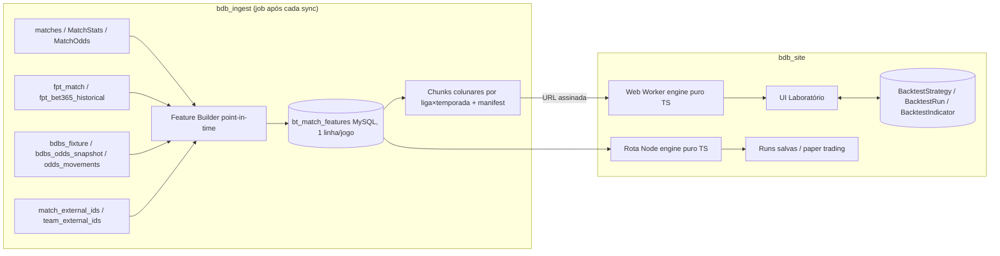

# Backtest Livre — Plano de Arquitetura (v0.3, 24/09/2026)

> Segundo modelo de backtest da plataforma, construído do zero e independente do backtest atual
> (`docs/Backtest_Direcoes.md`, `/dashboard/backtest`). Objetivo: um laboratório **sem amarras**
> onde o usuário cruza odds e estatísticas, cria indicadores por fórmula, define entradas em
> qualquer mercado e valida o resultado com rigor estatístico (CLV, p-valor, bootstrap, walk-forward).
>
> Status: **plano aprovado em 24/09/2026** — todas as decisões da seção 2 foram fechadas pela coluna
> "Recomendação". A v0.2 incorporou a avaliação das fontes FPT e Flashscore (seção 1.5) e o desenho
> de feature store multi-fonte (seção 4). A v0.3 registra a Fase 0 concluída (`docs/Backtest_Livre_Fase0.md`):
> catálogo v1, mapa das ligas só-FPT, spike de desempenho e a decisão de chunks por grupo de colunas (§4.3).

---

## 0. Sumário executivo

- O backtest atual é um "funil fechado": modelo → EV → um mercado. O novo é um **motor de expressões**
  sobre uma **tabela de features point-in-time** (uma linha por jogo, com odds e estatísticas
  observáveis antes do jogo), que liquida qualquer entrada e produz um *tearsheet* completo.
- **Três fontes, um universo**: o núcleo (`matches`, 55 k jogos, estatísticas ricas, 5 casas), a
  FutPythonTrader (`fpt_*`, 246 k jogos, odds de fechamento bet365 em ~20 mercados, 156 ligas) e o
  scraper do Flashscore (`bdbs_*`, abertura e fechamento de 10 casas, todas as linhas, tempo integral
  e 1º tempo). A feature store unifica as três com flag de origem e cobertura por campo.
- Três pilares, cada um testável isoladamente:
  1. **Feature store point-in-time** (job offline, sem vazamento temporal por construção).
  2. **Engine puro em TypeScript** (sem banco, sem `eval`): AST de regras → seleção → entradas → staking → liquidação → métricas.
  3. **UI de laboratório** (builder visual + modo fórmula, resultados em tearsheet).
- O engine roda no **navegador (Web Worker)** sobre chunks colunares por liga/temporada, e o mesmo
  código roda em Node para testes, execução no servidor e paper trading. Motivo: o MySQL compartilhado
  e o serverless da Vercel não sustentam consultas pesadas nem varreduras de parâmetros.
- Entrega em 6 fases (seção 8). A Fase 1 (feature store) já corrige dois defeitos do backtest atual
  (vazamento do ρ e bug de xG) e fica disponível para outras ferramentas do site.

---

## 1. Diagnóstico (o que existe e o que limita)

### 1.1 Dados disponíveis (medido no banco de produção em 24/09/2026)

| Item | Valor |
| --- | --- |
| Jogos FINISHED (núcleo `matches`) | 55.498 (jun/2018 a set/2026; massa real de 2023 em diante). Fontes adicionais FPT e Flashscore: seção 1.5 |
| Competições | 77 (76 ligas + Copa do Mundo), 2 a 4 temporadas cada |
| Jogos com `MatchStats` | 53.699 (96,8%) |
| … com chutes / escanteios / passes / faltas / cartões | ~53.200 (96%) |
| … com xG | 44.527 (80%) |
| … com xG 1º tempo | 24.206 (44%) |
| … com big chances / chutes na área / toques na área | 50.650 / 53.229 / 51.588 |
| Placar de intervalo (`hthg/htag`) | 40.409 (73%) |
| Rodada (`round`) | 54.981 (99%) |
| Árbitro | 32.830 (59%) |
| Linhas de odds (`MatchOdds`) | 3.088.802 |
| Jogos com odds de fechamento por ano | 2023: 91% · 2024: 96% · 2025: 98% · 2026: 99% |
| Jogos com odds de abertura por ano | 2023: 33% · 2024: 34% · 2025: 54% · 2026: 79% |
| `odds_movements` (marcos 30m…30d) | só a partir de mai/2026, e expurgado após 30 dias (job `purge-movements` do bdb_ingest) |
| `PlayerMatchStats` / `Shot` | 2,2 M / 956 k (não usados na v1) |

Mercados e casas presentes em `MatchOdds`:

| Mercado (`Market.key`) | Seleções | Linhas |
| --- | --- | --- |
| `match_odds` (1X2) | home / draw / away | — |
| `btts` | yes / no | — |
| `total_goals` | over / under | 0.5 a 7.5 (2.5 em 291 k linhas); quartos (2.25, 2.75, 3.25) só em parte da base |
| `asian_handicap` | home / away | -1.75 a +1.75, sempre do ponto de vista do mandante |
| `match_corners` | over / under | 5.5 a 15.5 (9.5 e 10.5 dominam) |

Casas: `pinnacle` (única `isSharp`), `bet365`, `betfair-exchange`, `kambi`, `betano`. Tipos: `PREMATCH_OPENING` e `PREMATCH_CLOSING`.
Observação importante: para bet365 vinda do Flashscore, o `MatchOdds` guarda **só a linha principal** de AH e as linhas de gols 0.5–4.5 (~34 linhas por jogo). Backtests de linha fixa de AH só encontram os jogos em que aquela linha era a principal.

### 1.2 O que o backtest atual entrega e por que não serve como base

Fluxo (`app/api/backtest/run/route.ts`, 484 linhas): liga/temporada/data → filtros de faixa de odds → snapshot da liga + médias do time → modelo (Poisson/ZIP/NB/DC) → matriz 11×11 → EV/probabilidade → um mercado, uma seleção, stake flat → KPIs.

Limitações estruturais:

- **Fechado em um funil**: a única forma de decidir é "modelo × odd". Não há como escrever `odd_abertura/odd_fechamento > 1.05 e xG_10 > 1.6`.
- **Snapshots não são mantidos**: `LeagueSnapshot` e `MatchTeamStats` só existem onde o script `scripts/backfill-team-stats.ts` rodou (26.132 snapshots e 48.744 jogos com médias, contra 55.498 jogos). Nada roda após cada rodada.
- **Vazamento temporal**: o ρ de Dixon-Coles é estimado com a temporada inteira, inclusive jogos futuros ao snapshot (`backfill-team-stats.ts:55-56`).
- **Bug de xG**: em `projections.ts:272-275` o método XG usa o xG *criado* como se fosse xG *sofrido*.
- **Médias pobres**: 8 campos, sem separação casa/fora, sem xG sofrido, sem forma, sem descanso, sem posição na tabela.
- **Casa de execução ambígua**: bet365 ou "a primeira que aparecer" (`candidates[0]`), fonte ignorada.
- **Sem validação estatística**: nem CLV, nem p-valor, nem drawdown, nem split treino/teste.
- **Lógica dentro da rota**: não testável fora de HTTP; tudo em memória por requisição.

O que **reaproveitar** (puro, testado):

- `lib/ferramentas/backtest/settlement.ts` → `liquidarAposta` (aritmética inteira ×4, linhas de quarto, AH pelo lado do mandante).
- `lib/ferramentas/backtest/kpis.ts` → `calcularKPIs` (a ser estendido).
- `lib/ferramentas/backtest/backfill-logic.ts` → `obterPartidasPassadasValidas` (corte temporal) e `calcularStatsParaTime` (generalizar).
- `lib/analytics/*` (poisson, dixon-coles, zero-inflated, negative-binomial, medias, forca-time, decay, lambda-calculators puros, model-selector). Importar os submódulos, não `lib/analytics/index.ts` (puxa Prisma).
- `lib/ferramentas/validacao-risco/monte-carlo.ts` e `estatisticas.ts` (p-valor, IC).
- `lib/ferramentas/over-under-linhas/*` (juice, linha âncora, probabilidade por linha).

### 1.3 Restrições de infraestrutura (medidas nesta sessão)

- O MySQL compartilhado (Hostgator) **estourou o disco temporário** numa consulta `GROUP BY` com `COUNT(DISTINCT)` sobre `MatchOdds` (erro 28, "No space left on device"). Agregações pesadas no banco estão descartadas.
- `connection_limit=3` por instância (`lib/prisma.ts`); API roda em serverless (Vercel) com limite de duração por requisição.
- O único escritor de odds é o repositório irmão **`bdb_ingest`** (scheduler de jobs). É o lugar natural para jobs pesados e recorrentes.

Consequência: o motor **não pode depender de SQL analítico nem de requisições longas**. Ele precisa de dados pré-computados e compactos, avaliados em memória.

### 1.4 O que o mercado faz (síntese da pesquisa)

Referências completas no Apêndice A. Conclusões que moldam o plano:

- Betaminic, Football Backtester, BetLab, Futbolpractice, FootyStats: filtros com resultado instantâneo, P&L a stake fixa, yield/ROI/drawdown, breakdown por bucket de odds e por mês. Críticas recorrentes: overfit por refino de filtros olhando o resultado; seleção com odds de abertura mas liquidação com fechamento (não reproduzível); sem split treino/teste, sem p-valor, sem CLV.
- Pinnacle/Buchdahl/RebelBetting: **CLV** (odd apostada ÷ odd justa de fechamento) é o indicador que prevê yield futuro quase 1:1 e converge com centenas de apostas (o lucro precisa de milhares). Curvas "real × esperado × CLV acumulado" no mesmo gráfico.
- Football-Data (Buchdahl): teste t do yield contra o esperado, desvio do yield ∝ √(odd média − 1)/√n, número mínimo de apostas para significância.
- penaltyblog / sports-betting (open source): separação estrita *lookback* × *fixture* (anti-leakage), walk-forward via `TimeSeriesSplit` por padrão.
- Finanças (vectorbt, backtrader, López de Prado): vetorizar por padrão; look-ahead como primitiva do engine ("nada da barra atual"); walk-forward com janelas fixadas antes; **contar tentativas** e deflacionar (Deflated Sharpe / PBO); tearsheet (quantstats) com underwater, heatmap mensal, tabela de drawdowns.
- Rule builders: AST JSON (JsonLogic-like) avaliado no front e no back, comparação campo-vs-campo, grupos AND/OR aninhados, gramática mínima sem `eval` (cuidado: math.js teve escape de sandbox, CVE-2026-41139).

### 1.5 Avaliação das fontes adicionais: FPT e Flashscore (medido em 24/09/2026)

O banco tem, além do núcleo, duas fontes que o backtest atual ignora. Ambas são escritas pelo `bdb_ingest` (FPT) e pelo `bdb_scraping` (Flashscore) e já estão vinculadas ao núcleo por `match_external_ids`.

#### FutPythonTrader (`fpt_bet365_historical`, `fpt_match`)

| Item | Valor |
| --- | --- |
| Jogos | 246.480 (1998 a 18/09/2026); massa real a partir de 2021: 29 k (2021), 44 k (2022), 45 k/ano (2023–2025), 31 k (2026) |
| Ligas / países / temporadas | 156 / 56 / 30 |
| Vinculados ao núcleo (`match_external_ids`, fonte `FPT_BET365`) | 51.484 jogos; cobre 92–94 % dos jogos FINISHED do núcleo de 2023 em diante |
| Jogos em ligas que o núcleo **não** tem | 124.885 (86 ligas): Itália Serie D 15 k, Espanha 4ª 7,7 k, Itália Serie C 5,8 k, copas nacionais, Champions/Europa/Conference League, 2ªs divisões de 30 países, feminino |
| Jogos de 2021–2022 em ligas do núcleo (o núcleo começa em 2023) | ~65 k, 70 ligas |
| Sync | diário (`fpt-daily-sync` 06:00, `fpt-reconcile` após o sync do núcleo, bulk 2×/semana) |

Odds (uma única foto por jogo, bet365; conferido contra o núcleo em mar/2025: bate com o **fechamento** em 51 % dos jogos a ±0,02 e diferença média 0,08, contra 12 % e 0,29 para a abertura → tratar como **fechamento**):

| Mercado | Colunas | Preenchimento (2021 → 2026) |
| --- | --- | --- |
| 1X2 FT e HT | `oddHFt/DFt/AFt`, `oddHHt/DHt/AHt` | 90 % → 97 % |
| O/U gols FT 0.5–4.5, HT 0.5–2.5 | `oddOverXXFt/Ht` | 89 % → 97 % |
| BTTS, Dupla chance | `oddBttsYes/No`, `oddDc1x/X2/12` | 90 % → 97 % |
| Handicap asiático H/A ±0.5, ±1, ±1.5, ±2, ±2.5 (sem quartos) | `ahHNeg05 … ahAPos25` | 47 % → 96 % |
| Handicap europeu ±1..3 (H/D/A) | `ehHNeg1 … ehAPos3` | 41 % → 96 % |
| Placar exato 0–3 × 0–3 | `oddCs0x0 … oddCs3x3` | 88 % → 97 % |

Estatísticas (por tempo: FT, HT, 2T): placar de intervalo em 100 %; chutes, chutes no alvo, escanteios, posse, faltas e cartões em 54 % (2021) → 75 % (2026); xG só a partir de 2023 (24 % → 46 %); big chances, xGOT, xA só a partir de 2025 (~40 %). Nas ligas fora do núcleo o xG é praticamente zero e as estatísticas de volume cobrem 0–60 % conforme a liga.

Limitações: sem odds de abertura (logo sem movimento de linha e sem CLV contra Pinnacle nos jogos que só existem na FPT); data com horário local e vínculo por nome de time (reconciliação Jaro-Winkler, janela ±1 dia, 0 links `verified`); sem id de time do núcleo para as ligas extras (identidade = nome canônico da FPT).

**Veredito FPT**: entra como **universo estendido** da feature store. Três ganhos concretos:
1. **+125 k jogos em 86 ligas** que o site não tem (com odds de fechamento bet365 completas, placar FT/HT e estatísticas parciais).
2. **+2 temporadas (2021–2022) nas ligas do núcleo**, o que dá histórico para as janelas móveis logo no início de 2023 (hoje as primeiras rodadas de cada liga são descartadas por falta de amostra).
3. **Mercados que o núcleo não tem**: 1X2 e O/U de 1º tempo, placar exato, dupla chance, handicap europeu — liquidáveis com `hthg/htag` e `fthg/ftag`.

#### Flashscore (`bdbs_fixture`, `bdbs_odds_snapshot`, `bdbs_odds_movements`)

| Item | Valor |
| --- | --- |
| Fixtures | 61.508 (nov/2023 a jun/2027), 107 ligas; 46.802 com odds coletadas (2024: 3,9 k · 2025: 22,6 k · 2026: 20,3 k) |
| `bdbs_odds_snapshot` | 19,1 M linhas, coleta iniciada em 21/08/2026 (varredura retroativa dos jogos encerrados); flags `is_opening`/`is_closing` |
| Casas | bet365, betano, betfair_ex, superbet, 1xbet, estrela_bet, f12, sportingbet, kto, betnacional |
| Mercados | 1x2, ou, ah (FT **e HT**, todas as linhas ~118 por jogo), btts, dc, dnb |
| Movimentos (`bdbs_odds_movements`) | só jogos de 2026 (3.201 fixtures), série por delta; promovidos a `odds_movements` com marcos |
| Vínculo | `match_external_ids` fonte `FLASHSCORE`: 34.632 partidas |

Hoje o job `flashscore-promote-historical` copia para `MatchOdds` apenas ~34 linhas por jogo (1x2, BTTS, gols 0.5–4.5, AH principal) e só da bet365. A tabela bruta tem 10 casas, todas as linhas e o 1º tempo.

**Veredito Flashscore**: é a fonte de **abertura e fechamento por casa** para 2024+, superior ao `MatchOdds` em largura (10 casas, linhas de quarto, HT). A feature store lê `bdbs_odds_snapshot` diretamente (com o vínculo `FLASHSCORE`), sem depender do promote parcial. Os marcos intermediários (D-1, 6h, 1h) continuam vindo de `odds_movements`, que passa a não ser expurgado (D3).

#### Estratégia de unificação (resumo; detalhes na seção 4)

- Uma linha por jogo com `source_core`, `source_fpt`, `source_fs` (bool) e `n_sources`.
- Chave de partida: `matchId` do núcleo quando existe; senão `fpt:<fpt_match.id>`. Time: sempre `teams.id` quando o nome resolve (`team_external_ids`, `TeamAlias` ou a partida vinculada); só sem vínculo algum, `fpt:<nome canônico>` como identidade provisória (D10).
- Precedência por campo: placar e estatísticas → núcleo, depois FPT; odds bet365 fechamento → Flashscore, depois `MatchOdds`, depois FPT; odds de abertura → Flashscore, depois `MatchOdds`; mercados exclusivos (HT, CS, DC, EH) → FPT e Flashscore.
- Partida FPT sem vínculo entra como linha `fpt:` a menos que o núcleo tenha jogo daquela competição em ±1 dia (aí é resíduo de reconciliação e fica fora). Regra por rodada, não por temporada: temporadas truncadas ou metades ausentes no núcleo (USL 2025, Colômbia Clausura, 2021–2022) vêm da FPT.
- Nada de cruzamento de temporadas entre nomes diferentes do mesmo time: quando um time ganha vínculo ao núcleo, o job reconstrói suas janelas.
- Cada feature tem cobertura por liga×temporada em `bt_coverage`, e o engine avisa quando a regra usa um campo com cobertura < 80 % no universo escolhido.

---

## 2. Decisões (fechadas em 24/09/2026 pela coluna "Recomendação")

| # | Decisão | Recomendação (adotada) | Alternativa (descartada) |
| --- | --- | --- | --- |
| D1 | Onde o engine roda | **Web Worker no navegador** sobre chunks colunares por liga/temporada; mesmo código em Node para testes, runs salvas e paper trading | Só servidor (rota Node com `maxDuration` alto) — simples, mas trava em varreduras, bootstrap e "todas as ligas" |
| D2 | Onde roda o job da feature store | **`bdb_ingest`** (já tem scheduler, acesso ao banco e roda após cada sync) | Script em `bdb_site/scripts` disparado manualmente ou por cron da Vercel (frágil) |
| D3 | Retenção de `odds_movements` | **Parar o expurgo** (ou arquivar marcos em tabela compacta) para, daqui em diante, ter snapshots "D-1", "6h", "1h" além de abertura/fechamento | Manter expurgo; só abertura/fechamento (é o que a base histórica tem hoje de qualquer forma) |
| D4 | Gate de plano | Igual ao backtest atual (`VIP_PRO` ou legado, `hasBacktestAccess`) | Novo nível |
| D5 | Modo fórmula (texto) para o usuário final | **Sim, desde a v1**, atrás de "modo avançado"; builder visual e fórmula geram o mesmo AST | Só builder visual na v1 |
| D6 | Nome/rota | `/dashboard/laboratorio` ("Laboratório de Estratégias") | `/dashboard/backtest-livre` |
| D7 | Dados de jogador (`PlayerMatchStats`, `Shot`) na v1 | **Não** (P2: features agregadas do time, ex. xG de bola parada, chutes de fora da área) | Sim |
| D8 | Entrega dos chunks ao navegador | Arquivos binários versionados em storage (Vercel Blob/S3/Cloudinary raw) com URL assinada por plano | Rota da API que serializa do MySQL (mais lenta, mais carga) |
| D9 | Fontes além do núcleo | **FPT como universo estendido** (ligas extras + 2021–2022 + mercados HT/CS/DC/EH) e **Flashscore como fonte de abertura/fechamento por casa**, ambos na Fase 1 com flags de origem | Só o núcleo (55 k jogos, sem HT nem ligas extras) |
| D11 (25/09) | Casas de apostas na v1 | **Só bet365 e Pinnacle** geram campos (`CASAS_ATIVAS` em `catalogo.ts`). As outras 12 casas (betano, betfair, kambi, superbet, 1xbet, estrela_bet, f12, sportingbet, kto, betnacional, avg, best) continuam definidas com fontes e mercados; ligar uma = adicionar à lista, regenerar o catálogo e subir a versão. Chunks por grupo `odds.<casa>.<snapshot>` já isolam cada casa | Todas as 14 casas desde a v1 (catálogo de 1.315 campos, chunks maiores, sem uso imediato) |
| D12 (25/09) | Ligas que migram da FPT para o núcleo | **Migração sem quebrar estratégias salvas.** Quando uma liga só-FPT ganha `Competition` no núcleo e vínculo em `competition_external_ids`, o builder passa a usar `Competition.id` como chave e grava em `manifest.aliases` o par `fpt:<rawLeague> → Competition.id`; o engine resolve aliases ao carregar uma estratégia. Times ganham `teamId` pelo resolver (D10) e são recomputados; partidas FPT vinculadas pelo `fpt-reconcile` deixam de ser linhas `fpt:` e viram a linha do núcleo (a FPT continua preenchendo o que o núcleo não tem). O histórico 2021–2022 da liga permanece como linhas `fpt:` sob a mesma competição | Congelar as ligas só-FPT como competições separadas para sempre |
| D13 (25/09) | Persistência da feature store | **Só chunks em storage + metadados no MySQL** (`bt_dataset` com versão, hash, contagens, cobertura por liga×temporada). Sem tabela larga `bt_match_features`: 300 k jogos × 1,3 k colunas seriam 0,5–1,5 GB num MySQL compartilhado já apertado de disco. A rota Node lê os mesmos chunks do storage. Provedor: **Cloudflare R2** (S3-compatível, sem custo de egresso); até as credenciais existirem, o job grava em disco local na VPS e o site lê por HTTP do próprio bdb_ingest | Tabela larga no MySQL (inviável) ou Cloudinary raw (limites de arquivos) |
| D10 | Identidade de times | **`teams` é a identidade.** Todo nome da FPT é resolvido primeiro para um `teamId` de `teams` (via `team_external_ids` fonte `FPT_BET365`, chave = nome normalizado, e `TeamAlias`). Só quando o nome não existe em `teams` a feature store usa o nome canônico da FPT (`fpt:<nome>`) como identidade provisória; assim que o resolver (`identity:resolve`) criar o vínculo, o job recomputa esse time com o `teamId` | Criar times em `teams` para todas as ligas da FPT (poluiria a tabela recém-podada) ou usar só nomes da FPT (perderia a identidade já consolidada do núcleo) |

---

## 3. Arquitetura



### 3.1 Pacotes (código)

```
lib/laboratorio/
  schema/         # catálogo de campos (nome, tipo, unidade, descrição, cobertura)
  features/       # builder point-in-time (puro: recebe jogos passados, devolve linha de features)
  engine/                       # Fase 2 (feita em 25/09/2026 — docs/Backtest_Livre_Fase2.md)
    tipos.ts      # Dataset, Estrategia (JSON persistido), Entrada, Staking, Aposta, RunResult
    ast.ts        # nós do AST + resolução de nomes + validação por unidade
    parser.ts     # fórmula texto -> AST (gramática própria, sem eval) e AST -> texto
    compile.ts    # AST -> (i) => number sobre colunas; rank/pct_rank por escopo
    matematica.ts # no-vig (4 métodos), Poisson/DC/ZIP/NB, linhas e AH sobre a matriz, RNG, hash
    modelos.ts    # model(MODELO, LAMBDA, JANELA).saida(...)
    universo.ts   # filtro de universo (ligas, temporadas, datas, fontes, cobertura mínima)
    entradas.ts   # mercado × seleção × linha × casa × snapshot -> colunas; referência q̂ (CLV)
    liquidacao.ts # 11 mercados (mesma aritmética do settlement atual + corners, HT, DC, EH, CS)
    staking.ts    # flat, % banco, Kelly fracionário, to-win
    metricas.ts   # resultado, caminho/risco, CLV, inferência (t, bootstrap em blocos), segmentos
    estrategia.ts # prepararEstrategia(): parse, dependências, validação, campos, aviso de leakage
    run.ts        # orquestra tudo; retorna RunResult serializável e determinístico (hash)
    catalogo.ts   # ponte com schema/ (única dependência externa do engine)
    (Fase 5)      # validacao.ts (splits, walk-forward, holdout), sweep.ts (varredura + tentativas), montecarlo, calibração
  data/           # chunk.ts (leitor formato 1, DecompressionStream/zlib), dataset.ts (manifesto, montagem), r2.ts, servidor.ts
  worker/         # Fase 3: sessao.ts (núcleo testável + caches), protocolo.ts, laboratorio.worker.ts, cliente.ts
  api/            # Fase 3: auth (gate), schemas (zod), runs (persistência + tentativas), indicadores
```

Regra de ouro: **nada em `lib/laboratorio/engine` importa Prisma, `next` ou DOM**. Tudo é função pura sobre arrays. Isso garante que o mesmo código rode no Worker, em Node e nos testes.

---

## 4. Feature store point-in-time

### 4.1 Princípio

Para o jogo `X` (data `T`), toda feature usa **somente** jogos `Y` com `Y.utcDate < T`, `Y.status = FINISHED`, e odds com `as_of < T`. O próprio jogo nunca entra. Parâmetros de liga (μ, var, π, ρ) são recalculados até `T` (corrige o vazamento do ρ). Teste automático obrigatório: recomputar a linha de `X` após apagar todo o futuro deve produzir bytes idênticos.

### 4.1.1 Universo unificado (núcleo + FPT + Flashscore)

O builder monta primeiro um **grafo de partidas unificado** e só depois calcula features:

1. **Partidas**: todas as `matches` FINISHED do núcleo + todas as `fpt_bet365_historical` com placar. Partidas da FPT vinculadas ao núcleo (`match_external_ids`, fonte `FPT_BET365`) são a mesma linha; as demais viram linhas `fpt:<id>`. Fixtures do Flashscore só contribuem odds (nunca criam partida).
2. **Competições**: `competition_external_ids` mapeia `rawLeague` da FPT para a competição do núcleo (70 ligas). As 86 ligas só-FPT viram competições virtuais `fpt:<rawLeague>` com país e nível inferidos do nome (`ITALY 4` → Itália, nível 4; `WOM SPAIN 1` → feminino, excluído por padrão).
3. **Temporadas**: `fpt_season_alias` + `rawSeason`; para ligas só-FPT, a temporada é a da FPT.
4. **Times** (D10): a identidade é sempre `teams.id`. Ordem de resolução de um nome da FPT: (a) `team_external_ids` fonte `FPT_BET365` pelo nome normalizado; (b) `TeamAlias`; (c) se a partida FPT está vinculada ao núcleo, os `homeTeamId/awayTeamId` da partida do núcleo (e o job grava a sugestão de vínculo para o resolver); (d) só sem nenhuma das anteriores, `fpt:<nome canônico>` como identidade provisória, marcada `team_provisional = true`. O histórico de um time é a união dos seus jogos nas duas fontes, deduplicado pelo vínculo de partida. O job emite a lista de nomes provisórios por liga para alimentar `identity:resolve` do `bdb_ingest`; ao surgir o vínculo, o time inteiro é recomputado sob o `teamId`.
5. **Data/hora**: núcleo em UTC; FPT tem data + `time` local sem fuso → o builder usa `utcDate` do núcleo quando há vínculo e, para jogos só-FPT, `date + time` marcados como `tz_uncertain = true` (ordem dentro do mesmo dia é resolvida por `time`; features de descanso em dias ignoram a hora).
6. **Precedência por campo** (primeiro que existir): placar FT/HT → núcleo, FPT (exceção: núcleo FINISHED com 0-0 sem estatística e FPT vinculada com outro placar usa a FPT e conta `placarCorrigidoPelaFpt`; qualquer outra divergência mantém o núcleo e conta `placarDivergente`); estatísticas → núcleo (`MatchStats`), FPT; odds bet365 fechamento → Flashscore (`is_closing`), `MatchOdds` (`PREMATCH_CLOSING`), FPT; odds bet365 abertura → Flashscore (`is_opening`), `MatchOdds` (`PREMATCH_OPENING`); outras casas → Flashscore, `MatchOdds`; mercados HT/CS/DC/EH → Flashscore (HT), FPT.
7. **Flags**: `src_core, src_fpt, src_fs, stats_src, odds_close_src, odds_open_src`, mais `n_sources`. Tudo que alimenta a UI de cobertura e os avisos do engine.

O teste de paridade da Fase 1 inclui: para os 51 k jogos vinculados, placar FT/HT do núcleo = FPT em ≥ 99,5 % (divergências vão para `unresolved_entities` como suspeita de vínculo errado), e odd bet365 de fechamento Flashscore vs `MatchOdds` dentro de ±0,02 em ≥ 90 %.

### 4.2 Blocos de features (uma linha larga por jogo)

**Núcleo do jogo**
`match_id, competition, competition_level, country, season, round, utc_date, tz_uncertain, dow, hour_local, home, away, ft_h, ft_a, ht_h, ht_a, has_xg, has_ht, referee, src_*`

**Odds por snapshot** (`open`, `close`; futuramente `d1`, `h6`, `h1` via D3), por casa (`pinnacle`, `bet365`, `betano`, `betfair`, `kambi`, e do Flashscore `superbet`, `1xbet`, `estrela_bet`, `f12`, `sportingbet`, `kto`, `betnacional`) e agregados (`avg`, `best`):
- 1X2: `odd_h, odd_d, odd_a`, `overround`, `novig_h/d/a` (métodos: proporcional padrão; power e Shin como opções calculadas no engine).
- BTTS: `yes, no, overround`.
- O/U gols: `main_line`, `over/under` para linhas 0.5–4.5 fixas **e** a linha principal; `novig_over` na linha principal.
- AH: `main_line`, `home/away` na linha principal; conversão para probabilidade via distribuição (engine).
- Escanteios: `main_line`, `over/under`.
- **1º tempo** (Flashscore e FPT): `ht.1x2.h/d/a`, `ht.ou.main_line`, `ht.ou.over/under` (0.5–2.5), `ht.ah.main_line`.
- **Placar exato** (FPT, bet365 fechamento): grade 0–3 × 0–3 (`cs.1_1`, …) + `cs.other`; **dupla chance** `dc.1x/x2/12`; **handicap europeu** `eh.h_m1`, `eh.d_m1`, `eh.a_m1` … (±1, ±2, ±3).
- Derivados prontos: `move_1x2_h = close/open − 1`, `move_ou_over`, `line_shift_ah = close.main_line − open.main_line`, `market_lambda_h/a` (via `calibrarLambdas` de `lib/analytics/lambda-calculators.ts`, puro), `fav_side`, `fav_odd`, `odd_gap = odd_a − odd_h`.

**Estatísticas de time** (para `home` e `away`, em janelas `l5, l10, l20, season`, e separando `all` e `venue` — só jogos em casa para o mandante, só fora para o visitante):
- Gols: `gf, ga, gd, pts_pg, win%, draw%, loss%, btts%, over15%, over25%, over35%, cs%, fts%`, `ht_gf, ht_ga`.
- xG: `xg_for, xg_against, npxg_for (P2), xg_diff, xg_over/underperf = gf − xg_for`, `xg_1h_for`.
- Volume: `shots_for/against, sot_for/against, sot%`, `shots_inbox`, `big_chances_for/against`, `corners_for/against`, `possession`, `pass_acc`, `touches_pa`, `fouls, yc, rc`.
- Dispersão e forma: `cv_goals`, `std_gf`, `form5 (pontos)`, `streak_win/unbeaten/scoring`, `elo` (rating simples atualizado jogo a jogo, P1), `rest_days`, `matches_last_7d`, `season_matches_played`, `table_pos, table_pts` (classificação recalculada até `T`).
- Mercado × desempenho: `clv_hist_l10` (o time vinha "batendo o fechamento"?), `fav_win%_l10` (quantas vezes foi favorito e venceu), `avg_odd_as_fav`.

**Parâmetros de liga até `T`**: `mu_h, mu_a, var_h, var_a, pi_h, pi_a, rho, mu_h_xg, mu_a_xg, n_matches_season, avg_overround_pinnacle`.

**Modelos (calculados sob demanda no engine, não armazenados)**: `model(POISSON|DC|ZIP|NB, lambda=MEDIA|FORCAS|XG|MERCADO, window)` → `p_h, p_d, p_a, p_over(L), p_under(L), p_btts, p_ah(L, side), fair_odd(...)`. Entram no engine como funções puras já existentes em `lib/analytics`, recebendo as médias e parâmetros que estão na linha.

Estimativa: ~300–400 colunas numéricas. Em `Float32` são ~1,4 KB por jogo; 55 k jogos do núcleo ≈ 80 MB brutos e o universo completo com FPT (~300 k jogos) ≈ 420 MB brutos, ~1 MB por liga×temporada. Chunks são carregados apenas para o universo escolhido; colunas ausentes numa liga (ex.: xG na Serie D) são omitidas do chunk e materializadas como `null` no engine.

### 4.3 Armazenamento (decidido na Fase 0 — `docs/Backtest_Livre_Fase0.md` §5)

- Tabela MySQL `bt_match_features` (larga, `matchId` único, `builderVersion`, `computedAt`). Serve para a rota Node, para auditoria e para reconstruir chunks. Escrita em lote pelo job.
- Chunks **por grupo de colunas**: cada `competition × season` é um diretório com um arquivo por grupo — `match` (com `league`), `derived`, `odds.<casa>.<snapshot>` (28), `team.<lado>.<escopo>.<janela>` (16), `team.<lado>.extra` (2). O Worker resolve os campos referenciados pela regra e pelas entradas → grupos → baixa só esses. Motivo: o spike mediu 1,4 KB gz por jogo com todas as colunas (15 MB para um universo típico, 72 MB para o núcleo), contra 100–250 B por jogo quando só os 4–8 grupos de uma regra típica são carregados.
- Formato de cada grupo: cabeçalho JSON (nomes, tipos, escalas, offsets) + um bloco gzip por coluna; valores em **Int32 escalado** por coluna (odds ×1000, probabilidades ×10000, linhas ×4, estatísticas ×100; sentinela para nulo), decodificados para Float64 no Worker. gzip porque o navegador descomprime nativamente (`DecompressionStream`).
- `manifest.json` por chunk com grupos, tamanhos, hash por grupo, versão do builder, contagem e datas; cache no navegador (`Cache API`) por hash de grupo.
- Versionamento: `builderVersion` muda quando qualquer regra de feature muda; runs salvas registram a versão e o hash do manifest (reprodutibilidade). Parquet/Arrow descartados (sem ganho que justifique a dependência).

### 4.4 Job

- Local: `bdb_ingest` (D2), encadeado após `sync-incremental` → `fpt-reconcile` → `flashscore-reconcile`, para ler os vínculos já atualizados. Modo incremental: recomputa apenas jogos com `utcDate` ≥ última rodada finalizada afetada (e todos os jogos futuros de times envolvidos, pois suas janelas mudaram); um vínculo novo de partida ou de time dispara recomputação das duas linhas e dos times. Modo completo: backfill total (~300 k jogos com a FPT; leitura por liga×temporada e cálculo em memória; alvo < 30 min na VPS).
- Também emite: `bt_coverage` por liga×temporada (% com xG, % com odds por casa e snapshot) para a UI alertar "cobertura insuficiente" e para o engine calcular o "viés de disponibilidade de odds".

### 4.5 Cobertura mínima e regras de amostra

- Uma feature em janela `lN` é `null` se houver menos de `min(N, 4)` jogos passados válidos; `season` exige ≥ 4 jogos.
- Parâmetros de liga exigem ≥ 20 jogos na temporada até `T`; antes disso usam a temporada anterior da mesma liga com decaimento (opção `carry_over=true`) ou ficam `null`.
- Cada linha carrega `n_used_*` por janela para o usuário filtrar por amostra mínima.

---

## 5. Engine

### 5.1 Fluxo de execução

1. **Universo**: ligas (do núcleo e só-FPT, com nível e país), temporadas, intervalo de datas, fontes aceitas (`src_core`, `src_fpt`), `min_coverage` (ex.: exigir odds de fechamento Pinnacle 1X2), exclusões (rodadas iniciais, copas, feminino).
2. **Indicadores**: expressões nomeadas avaliadas vetorialmente (uma `Float64Array` por indicador). Podem referenciar campos, outros indicadores, funções e parâmetros `$p`.
3. **Regras de seleção**: árvore AND/OR/NOT sobre comparações (campo ou indicador × constante ou campo/indicador) → máscara booleana.
4. **Entradas** (uma estratégia pode ter várias "pernas"; cada perna tem a própria condição adicional):
   - mercado (`1x2, btts, ou_goals, ah, ou_corners, ht_1x2, ht_ou, ht_ah, dc, eh, cs`), seleção fixa ou por expressão (`if(edge_h > edge_a, home, away)`), linha fixa / linha principal / por expressão (`quarter(expr)`),
   - **preço de decisão**: casa nomeada, `pinnacle`, `avg`, `best` (rotulado como cenário otimista, com haircut configurável) × snapshot (`open`, `close`, futuros `d1`, `h6`),
   - **preço de liquidação**: o mesmo, por padrão; CLV sempre contra `pinnacle.close` no-vig (fallback: `avg.close`),
   - filtros de preço (odd mín/máx), `slippage` em % (realismo).
5. **Staking**: `flat u`, `% do banco`, `Kelly f×` (fração, cap, mínimo), `to-win`, `exposição máx por dia`, `stop de drawdown`. Sem dependência de caminho o engine é vetorizado; com Kelly/% banco ele percorre as apostas em ordem cronológica.
6. **Liquidação**: `liquidarAposta` estendido (escanteios, mercados de HT usando `ht_h/ht_a`, dupla chance, handicap europeu, placar exato), void para jogos sem placar.
7. **Métricas e validação** (seção 6).
8. **Saída**: `RunResult` serializável (KPIs, séries, segmentos, lista de apostas com todas as colunas usadas, avisos de cobertura/leakage/amostra, hash de reprodutibilidade).

### 5.2 Linguagem de expressões

- Gramática própria mínima (parser recursivo em TS, sem dependência externa): números, identificadores com ponto (`home.l10.xg_for`), constantes de seleção (`home`, `away`, `over`…), `+ − × ÷ ^`, comparações, `and/or/not`, `if(c, a, b)`, parâmetros `$p`.
- Funções (allow-list): `abs, min, max, log, exp, sqrt, round, quarter, clamp, ifnull, coalesce`, `implied(odd)`, `novig(o1, o2[, o3], method)`, `fair_odd(p)`, `ev(p, odd)`, `edge(p, odd)`, `kelly(p, odd)`, `zscore(x, mean, sd)`, `model(...)` (seção 4.2), `pct_rank(expr, scope)` e `rank(expr, scope)` com `scope ∈ {day, round, league_season}` calculados point-in-time dentro do run.
- Tipagem com unidades: `odd`, `prob`, `count`, `rate`, `goals`, `days`, `bool`. O validador rejeita `odd > prob` sem conversão e avisa sobre `null` (cobertura).
- O builder visual e o modo fórmula produzem o **mesmo AST JSON**, que é o que se persiste. Nunca se avalia texto no servidor.
- Limites: profundidade, número de nós, tempo de avaliação; campos só do catálogo.

Exemplos que a v1 precisa aceitar:

```
# 1. Edge contra a Pinnacle usando odds de abertura da bet365
edge_h = odds.bet365.open.1x2.h * odds.pinnacle.close.novig_h - 1

# 2. Movimento de linha + forma
odds.pinnacle.close.1x2.h / odds.pinnacle.open.1x2.h < 0.93 and home.l5.pts_pg >= 1.8

# 3. Modelo × mercado
model(DC, FORCAS, l10).p_over(2.5) - odds.bet365.close.ou.novig_over > $p1

# 4. Cruzamento entre mercados
odds.pinnacle.close.ah.main_line <= -0.75 and odds.pinnacle.close.ou.main_line >= 3.0

# 5. Estatística × odd
(home.venue.l10.xg_for + away.venue.l10.xg_against) / 2 > 1.7 and implied(odds.bet365.close.ou.over_2_5) < 0.55
```

### 5.3 Desempenho (metas e medição da Fase 0)

- Carregar o universo típico (10 ligas × 3 temporadas) em < 3 s com cache no navegador (`Cache API`), depois avaliação de uma regra em < 100 ms.
- Bootstrap de 2.000 reamostras e Monte Carlo de 2.000 caminhos em < 2 s no Worker.
- Varredura de 200 combinações de parâmetros em < 10 s.
- **Medido no spike (55 k linhas, V8):** regra 3–8 ms, bootstrap 0,2 s, Monte Carlo 0,2 s, varredura 0,5 s; em 300 k linhas, varredura 2,4 s. A meta de carga só fecha com chunks por grupo de colunas (§4.3): com todas as colunas o universo típico pesa 15 MB gz.

---

## 6. Métricas, validação e anti-overfit

### 6.1 Resultado
`n`, turnover, lucro (u e R$), **yield** (lucro/turnover), **ROI sobre banco**, lucro a stake flat (comparabilidade), hit rate, odd média (simples e ponderada), break-even hit rate, profit factor, payoff.

### 6.2 Caminho e risco
Curva de banco, **max drawdown** (u e %), duração e recuperação, **underwater plot**, 5 maiores drawdowns, maior sequência de derrotas e sem novo máximo, Sharpe/Sortino por aposta, Calmar.

### 6.3 Esperado × real e CLV
- Probabilidade justa `q̂` = no-vig do fechamento Pinnacle (fallback média das casas; nos jogos só-FPT, no-vig do fechamento bet365, com rótulo "referência soft"). EV por aposta `o·q̂ − 1`; yield esperado; curva "real × esperado" acumulada.
- **CLV** por aposta: bruto (`o/o_close − 1`), no-vig (`o·q̂_close − 1`) e em pontos de probabilidade; **beat rate** (% CLV > 0); CLV acumulado em unidades; t-stat do CLV. Gráfico único com lucro real, esperado e CLV acumulado (padrão RebelBetting/Buchdahl).
- Para AH/O-U o CLV é sempre na **mesma linha**; quando a linha principal mudou entre snapshots, converte-se por distribuição e sinaliza-se.

### 6.4 Inferência
- t do yield e p-valor (bicaudal) contra `H0: yield = −margem`; aproximação de Buchdahl (`z ≈ yield·√n/√(odd_média − 1)`) exibida como referência.
- **IC por bootstrap em blocos** (bloco = dia/rodada) para yield, MDD e CLV.
- "Estratégia aleatória nos mesmos jogos" (Kaunitz): distribuição nula, resultado em σ.
- Nº mínimo de apostas para significância na odd média observada; aviso abaixo de 300–500 apostas.
- Monte Carlo (reaproveita `executarMonteCarlo`): distribuição do lucro final, MDD P50/P95/P99, probabilidade de ruína, para o staking escolhido.

### 6.5 Segmentação
Todas as métricas com `n` e IC por: liga, temporada, mês (heatmap), bucket de odds, casa, mercado, mandante/visitante, favorito/zebra, faixa de EV, faixa de CLV.

### 6.6 Validação temporal e controle de tentativas
- **Split treino/teste** por data; **por temporada** (folds); **walk-forward** (janelas fixadas antes; relatório só *out-of-sample* e *Walk-Forward Efficiency*).
- **Holdout selado**: a última temporada de cada liga fica oculta até o usuário "abrir o selo" para uma estratégia salva; o run registra que o selo foi usado.
- **Contador de tentativas** por estratégia/sessão (cada avaliação com regra diferente conta); yield/t deflacionados pelo número de tentativas (aproximação do Deflated Sharpe) e alerta de "resultado provavelmente por seleção".
- Varredura de parâmetros (`$p`): heatmap de yield × n; penalização por nº de parâmetros; PBO-lite (a melhor configuração in-sample fica abaixo da mediana out-of-sample?).

### 6.7 Calibração (quando a regra usa probabilidade de modelo)
Brier e log-loss vs baseline Pinnacle, diagrama de confiabilidade, ECE.

---

## 7. UI (Laboratório)

Página `/dashboard/laboratorio` (D6), gate igual ao backtest (D4), layout em duas colunas como o backtest atual (formulário à esquerda, resultados à direita), Recharts + shadcn já em uso.

Passos no painel esquerdo (accordion):
1. **Universo**: ligas (mesmos 5 modos de seleção do backtest atual), temporadas, datas, cobertura mínima, excluir rodadas iniciais.
2. **Indicadores**: catálogo pesquisável (campo, tipo, cobertura %, descrição, exemplo) + "meus indicadores" (fórmula, nome, salvar/compartilhar).
3. **Regras**: builder AND/OR (`react-querybuilder`, com campo-vs-campo) ↔ modo fórmula (textarea com validação e autocomplete do catálogo). Contagem de jogos selecionados atualiza ao vivo.
4. **Entradas**: pernas com mercado/seleção/linha/preço de decisão/snapshot/filtros de odd/slippage.
5. **Staking**: método e parâmetros, banco inicial, unidade (u/R$).
6. **Validação**: split, walk-forward, holdout, varredura (`$p` com faixas).
7. **Executar** (Worker, com barra de progresso) · **Salvar** · **Duplicar** · **Comparar** (até 5 estratégias lado a lado, como o Football Backtester).

Painel direito (tearsheet):
- Cards: n, yield, ROI, lucro, hit rate, odd média, MDD, CLV médio, beat rate, p-valor, aviso de amostra/tentativas.
- Gráfico principal: banco real × esperado × CLV acumulado; underwater abaixo.
- Abas: Segmentos (tabelas com n/IC), Mensal (heatmap), Validação (folds, walk-forward, holdout), Monte Carlo, Varredura, Apostas (tabela paginada + CSV com todas as colunas usadas), Calibração.
- Tooltips com fórmula e referência em cada métrica.

---

## 8. Fases e entregáveis

| Fase | Entrega | Critério de aceite |
| --- | --- | --- |
| **0. Fundações** — **feita em 24/09/2026** (`docs/Backtest_Livre_Fase0.md`) | Catálogo v1 com 1.315 campos (`lib/laboratorio/schema/catalogo.ts`, `npm run lab:catalogo`); mapa das 86 ligas só-FPT (`ligas-fpt.ts`); spike (`npm run lab:spike`) em 55 k e 300 k linhas; 13 testes | Metas da §5.3 batidas com folga de 10–30× no cálculo; carga exige chunk por grupos de colunas (§4.3); **revisão do catálogo pelo usuário pendente** |
| **1a. Feature store — núcleo** — **código feito em 25/09/2026** (`docs/Backtest_Livre_Fase1.md`) | Builder puro + loaders + job em `bdb_ingest` (`src/lib/laboratorio`, `src/jobs/laboratorio-build.ts`); chunks por grupo + manifest; leitura de `bdbs_odds_snapshot`; **sem tabela larga** (D13). Pendente: storage R2, backfill na VPS, ligar `LAB_BUILD_CRON` | Truncar futuro ⇒ linha idêntica ✅; paridade com `MatchTeamStats` 100 % (1.272 comparações) ✅; ρ/π/var point-in-time ✅; bet365 Flashscore = `MatchOdds` em 100 % onde o `MatchOdds` já é Flashscore ✅ (legado TheStatsAPI diverge, documentado); cobertura por liga no manifest ✅ |
| **1b. Feature store — FPT** — **junto com 1a** (loader único) | Competições virtuais `fpt:<rawLeague>`, times via `team_external_ids` → partida vinculada → `fpt:` provisório (D10), precedência por campo, mercados HT/CS/DC/EH, regra "FPT sem vínculo só em temporada não coberta" | Carry-over 2021–2022 → 2023 ✅; isolamento de jogo só-FPT ✅; placar núcleo = FPT nos vinculados **pendente**; unificar chaves novas da FPT (Primera Federación) **pendente** |
| **2. Engine** — **feita em 25/09/2026** (`docs/Backtest_Livre_Fase2.md`) | AST + parser + compilador + universo + entradas + liquidação (incl. HT, DC, EH, CS) + staking + métricas núcleo + `run.ts`; leitor de chunks (navegador e Node); CLI `npm run lab:run -- estrategia.json`; aviso de leakage | 151 testes puros novos ✅ (165 com o catálogo); paridade 1X2 flat em 3 ligas×temporadas: mesmos jogos e mesmos resultados, odds iguais onde o `MatchOdds` já é Flashscore (as demais diferem só pela fonte legada HISTORICAL) ✅; 5 exemplos da §5.2 executam no núcleo inteiro em 36–733 ms ✅ |
| **3. Dados e API** — **feita em 25/09/2026** (`docs/Backtest_Livre_Fase3.md`) | Worker (`lib/laboratorio/worker`: Sessao + cache memória/Cache API + cliente tipado); `POST /api/laboratorio/run` (Node); CRUD de estratégias, runs e indicadores; contador de tentativas; modelos Prisma + migração (aplicar com `prisma migrate deploy`) | Sessao = run direto com mesmo hash ✅ (teste); disco = R2 com mesmo hash em 2 universos ✅; 183 testes; `next build` ok |
| **4. UI** — **código feito em 25/09/2026** (`docs/Backtest_Livre_Fase4.md`) | `/dashboard/laboratorio`: 6 painéis (universo, indicadores/catálogo, regra com builder ↔ fórmula, entradas, staking, salvar), tearsheet (cards, banco × esperado × CLV, underwater, segmentos, mensal, risco, apostas + CSV, comparação de até 5 runs), Worker com cache; entrada no menu e nos acessos rápidos | 190 testes; `next build` ok; **teste ponta a ponta no navegador com usuário VIP_PRO pendente** (roteiro na Fase 4 §3) |
| **5. Validação avançada** | Bootstrap em blocos, estratégia aleatória, walk-forward, holdout selado, varredura + contador de tentativas + deflação, Monte Carlo, calibração | Testes com casos sintéticos de resposta conhecida (ex.: estratégia sem edge deve dar p ≈ uniforme) |
| **6. Operação** | Paper trading: jogos futuros que batem cada estratégia salva com odd atual e edge; comparação backtest × live; portfólio de estratégias (picks duplicados, drawdown conjunto); documentação do usuário | Estratégia salva gera lista de próximos jogos diariamente; alerta de degradação |

Ordem de dependência: 0 → 1a → 1b → 2 → 3 → 4 → 5 → 6. As fases 1a/1b e 2 podem andar em paralelo após o catálogo (a engine testa com fixtures sintéticas). A UI (Fase 4) pode ir ao ar só com o núcleo se a 1b atrasar, pois as flags de origem já fazem parte do schema desde a 1a.

---

## 9. Riscos e mitigação

| Risco | Mitigação |
| --- | --- |
| Feature store lenta ou pesada no MySQL compartilhado | Computação em memória por temporada no job; escrita em lote; tabela larga só com numéricos; chunks fora do banco |
| Cobertura desigual de odds (abertura só de 2025+ no `MatchOdds`, quartos e AH exóticos raros) | Flashscore bruto (`bdbs_odds_snapshot`) para 2024+ com todas as linhas; `bt_coverage` + avisos na UI; "linha principal" como padrão; viés de disponibilidade reportado (% de jogos elegíveis com odd) |
| Overfit pelo usuário | Holdout selado, contador de tentativas, deflação, walk-forward e IC obrigatórios no tearsheet (não opcionais) |
| Divergência entre Worker e servidor | Mesmo código puro; hash de reprodutibilidade comparado nos testes de integração |
| Segurança das fórmulas | Parser próprio, allow-list, sem `eval`/`Function`, limites de tamanho e tempo |
| Chunks expõem dados a usuários pagos | URL assinada com expiração, gate por plano, dados agregados (sem jogador na v1) |
| Manutenção da feature store para de rodar (como aconteceu com os snapshots) | Job no scheduler do `bdb_ingest` com monitoramento (`health-report`), `computedAt` visível na UI |
| Vínculo FPT ↔ núcleo errado (0 links `verified`, janela ±1 dia, nomes) | Teste de placar FT/HT igual nas duas fontes; divergência exclui o vínculo da feature store e alimenta `unresolved_entities` |
| FPT sem abertura → sem CLV nem movimento nos jogos só-FPT | Campos ficam `null`; UI avisa; referência de EV passa a ser bet365 fechamento com rótulo "soft" |
| Horário local sem fuso na FPT | `tz_uncertain`; ordem intra-dia por `time`; descanso em dias inteiros; nenhuma feature usa hora nesses jogos |
| Ligas só-FPT com estatísticas pobres (Serie D sem chutes) | Cobertura por campo em `bt_coverage`; regra que usa campo com cobertura < 80 % no universo gera aviso e mostra n efetivo |
| Volume do universo completo (~300 k jogos) no navegador | Chunks por liga×temporada carregados sob demanda; "todas as ligas" com aviso de tamanho e opção de rodar no servidor (rota Node da Fase 3) |

---

## 10. Fora de escopo (v1)

Apostas ao vivo/in-play, exchanges com liquidez/matching (modelo flumine; as odds back/lay da `fpt_betfair` têm só 1,3 k jogos desde set/2026 e ficam para depois), múltiplas/acumuladas, cash-out, dados de jogador e de chutes como features, ligas femininas da FPT, automação de apostas.

---

## Apêndice A — Referências consultadas

Produtos: Betaminic (Betamin Builder e FAQ; review de trial em bettingexchangetrials.com), Football Backtester, StatisticSports, BetLab, Futbolpractice, Predictology, FootyStats, Bet-Analytix, RebelBetting (CLV), Trademate, BetBurger.
Método: Pinnacle Betting Resources (CLV, credibilidade de tipsters, faixa de retornos, Kelly fracionário); Buchdahl / Football-Data.co.uk (notes.txt, "Testing your betting model", "Luck vs Skill", *The Wisdom of the Crowd*); WinnerOdds (p-valor e drawdown esperado); OddsPapi (pipeline de backtest); Kaunitz, Zhong & Kreiner 2017 (arXiv 1710.02824); Uhrín et al. 2021 (arXiv 2107.08827).
Open source: penaltyblog (backtest, kelly, implied), sports-betting (georgedouzas), flumine/betfairlightweight, vectorbt, backtrader (cheat-on-open), quantstats, purged-cross-validation; Bailey & López de Prado (Deflated Sharpe, PBO).
Rule builders: react-querybuilder, react-awesome-query-builder, JsonLogic, math.js (CVE-2026-41139), expr-eval, Jexl.
URLs completas: `docs/historico/Backtest_Livre_Pesquisa_2026-09-24.md`.

## Apêndice B — Mapa do código existente reaproveitável

| Arquivo | Função | Uso no novo motor |
| --- | --- | --- |
| `lib/ferramentas/backtest/settlement.ts` | `liquidarAposta` | Liquidação (estender para escanteios e HT) |
| `lib/ferramentas/backtest/backfill-logic.ts` | `obterPartidasPassadasValidas`, `calcularStatsParaTime` | Base do corte temporal; generalizar para todas as janelas/venue |
| `lib/analytics/poisson.ts`, `dixon-coles.ts`, `zero-inflated.ts`, `negative-binomial.ts` | matrizes de placar | `model(...)` no engine |
| `lib/analytics/medias.ts`, `forca-time.ts`, `decay.ts` | médias, forças, decaimento | Feature builder |
| `lib/analytics/lambda-calculators.ts` | `calibrarLambdas` (puro), `calcularLambdas*` | `market_lambda_*` e método MERCADO |
| `lib/analytics/model-selector.ts` | `rankearModelos` | Modo AUTO de modelo (P2) |
| `lib/ferramentas/validacao-risco/*` | Monte Carlo, p-valor, IC | Métricas de risco |
| `lib/ferramentas/over-under-linhas/*` | juice, probabilidade por linha | Conversão de linhas e CLV em AH/O-U |
| `lib/auth/check-access.ts` | `hasBacktestAccess` | Gate |
| `components/ferramentas/validacao-risco/*` | gráficos de banco e drawdown | Base visual do tearsheet |
